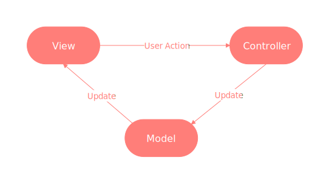
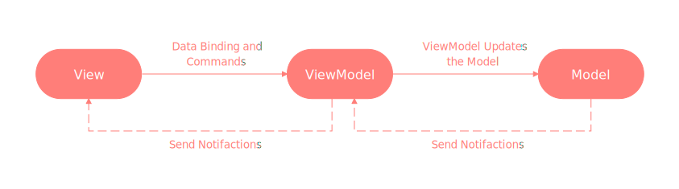
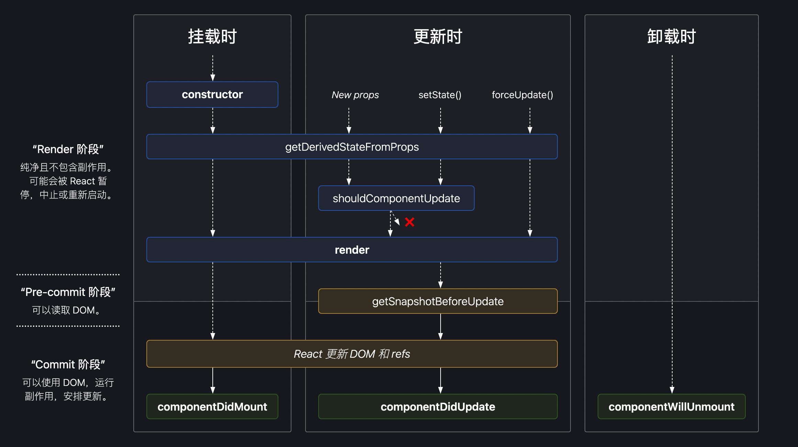

## React 简介

- React 是一个声明式，高效且灵活的用于构建用户界面的 JavaScript 库

  - 使用 React 可以将一些简短、独立的代码片段组合成复杂的 UI 界面，这些代码片段被称作“组件”
  - `ui = render (data)`：单向数据流

- MVC

  - View：视图
  - Model：数据
  - Controller：控制器

  

  ```js
  // model
  var myapp = {}; // 创建这个应用对象

  myapp.Model = function () {
    var val = 0;

    this.add = function (v) {
      if (val < 100) val += v;
    };

    this.sub = function (v) {
      if (val > 0) val -= v;
    };

    this.getVal = function () {
      return val;
    };

    // 观察者模式
    var self = this,
      views = [];

    this.register = function (view) {
      views.push(view);
    };

    this.notify = function () {
      for (var i = 0; i < views.length; i++) {
        views[i].render(self);
      }
    };
  };

  // view
  myapp.View = function (controller) {
    var $num = $("#num"),
      $incBtn = $("#increase"),
      $decBtn = $("#decrease");

    this.render = function (model) {
      $num.text(model.getVal() + "rmb");
    };

    // 绑定事件
    $incBtn.click(controller.increase);
    $decBtn.click(controller.decrease);
  };

  // controller
  myapp.Controller = function () {
    var model = null,
      view = null;

    this.init = function () {
      // 初始化 Model 和 View /
      model = new myapp.Model();
      view = new myapp.View(this);

      // View向Model注册，当Model更新就会去通知View啦
      model.register(view);
      model.notify();
    };

    // 让 Model 更新数值并通知 View 更新视图
    this.increase = function () {
      model.add(1);
      model.notify();
    };

    this.decrease = function () {
      model.sub(1);
      model.notify();
    };
  };

  // init
  (function () {
    var controller = new myapp.Controller();
    controller.init();
  })();
  ```

- MVVM

  - Model
  - View
  - ViewModel

  

  ```vue
  // model
  var data = {
      val: 0
  };

  // view
  <div id="myapp">
      <div>
          <span>{{ val }}rmb</span>
      </div>
      <div>
          <button v-on:click="sub(1)">-</button>
          <button v-on:click="add(1)">+</button>
      </div>
  </div>

  // controller
  new Vue({
    el: '#myapp',
    data: data,
    methods: {
      add(v) {
          if(this.val < 100) {
              this.val += v;
          }
      },
      sub(v) {
          if(this.val > 0) {
              this.val -= v;
          }
      }
    }
  });

  ```

- Vue 是不是 MVVM？React 呢？

  - 严格来讲都不是
  - React：ui = render (data) 单向数据流
  - Vue：ref，绑定在虚拟 DOM 上，但可直接操作 DOM，跳过了 ViewModel

## JSX

JSX 称为 JS 的语法扩展，将 UI 与逻辑层耦合在组件里，用{}标识

因为 JSX 语法上更接近 JS 而不是 HTML，所以使用 `camelCase`（小驼峰命名）来定义属性的名称；
JSX 里的 `class` 变成了 `className`，而 `tabindex` 则变为 `tabIndex`

```js
// 变量
const name = "Josh Perez";
const element = <h1>Hello, {name}</h1>;

function formatName(user) {
  return user.firstName + " " + user.lastName;
}

// 方法
const user = {
  firstName: "Harper",
  lastName: "Perez",
};

const element = <h1>Hello, {formatName(user)}!</h1>;

function getGreeting(user) {
  if (user) {
    return <h1>Hello, {formatName(user)}!</h1>;
  }
  return <h1>Hello, Stranger.</h1>;
}
```

```jsx
function VideoList({ videos, emptyHeading }) {
  const count = videos.length;
  let heading = emptyHeading;
  if (count > 0) {
    const noun = count > 1 ? "Videos" : "Video";
    heading = count + " " + noun;
  }
  return (
    <section>
      <h2>{heading}</h2>
      {videos.map((video) => (
        <Video key={video.id} video={video} />
      ))}
    </section>
  );
}
```

Babel js compiler
@babel/preset–react

## props state

- 组件

  ```jsx
  function Welcome(props) {
    return <h1>Hello, {props.name}</h1>;
  }

  class Welcome extends React.Component {
    render() {
      return <h1>Hello, {this.props.name}</h1>;
    }
  }
  ```

- props

  ```tsx
  export default function Profile() {
    return <Avatar />;
  }
  interface IAvatarProps {
    person?: Reacord<string, any>;
    size?: number | string;
  }
  function Avatar({ person, size = 10 }) {
    // ...
  }
  ```

- state

  ```jsx

  ```

## 生命周期


